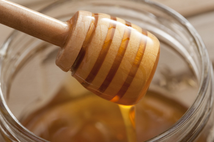

# Skattlåda: Secure, low-friction file sharing



**Skattlåda** (pronounced _skaht-loh-dah_) is a Swedish word often used by Scandinavian beekeepers to describe the compartment in a beehive that is used to collect honey. This section of a hive is also known as the "honey super". While a beehive retains some of its honey to feed the colony, most of it gets shared with all of us. Of course, to access this honey, you have to follow a strict protocol to avoid getting stung!

## Why another file sharing server?

Most file sharing is done within a closed system, where file access and identity are tightly coupled. This makes it difficult for someone to share a file with someone else outside of the system, without the recipient going through the hassle of setting up their own account. You can bypass some of the friction by supporting federation with well-known identity providers such as social login, but not everyone uses these.

**Skattlåda** makes this problem easier by allowing users to register and authenticate with [FIDO2](https://fidoalliance.org/fido2/). Registration takes a few seconds and authentication is even easier. FIDO2 is more secure than traditional credentials, like passwords, because its phishing-resistant. And, of course, there are no passwords to create, forget, or reset.

Out of the box, share files from Google Drive. The server is extensible so its possible to share with other systems.

## Setup

**Skattlåda** [runs in Docker](https://hub.docker.com/r/twistedstream/skattlada), so that's easy.

### Environment

Export the environment variables specified in [CONFIG](./CONFIG.md). For local development, you can use a `.env` file.

### Root invite

When you first start the server, watch the console output for an `INFO` event with the message `Root invite`, then copy the `url` value paste it into a browser. Follow the prompts to enroll the first admin account. The admin user can then create shares which is how they can invite more users.

## Local Development

To run **Skattlåda** outside of Docker, you just need to install the version of Node.js specified in the `engines.node` field of the [`package.json`](./package.json) file.

### Self-signed TLS certificate

When running in local development mode, the server uses HTTPS with a self-signed certificate for TLS communication. Generate and install the certificate using these commands:

```bash
sudo ./cert/create-dev-cert.sh
sudo ./cert/install-dev-cert.sh
```

This creates a `dev.crt` (certificate) and `dev.key` (private key) file in the `./cert` directory. It also installs the certificate so its trusted by your local machine.

### DNS

Add the following line to the `/etc/hosts` file:

```text
127.0.0.1  skattlada.dev
```

### Dependencies

Install dependencies

```shell
npm install
```

### Run

```shell
npm run dev
```

### Unit tests

Run all unit tests:

```shell
npm run test:unit
```

Run a specific test file:

```shell
npm run test:unit ./src/app.test.ts
```

### Integration tests

Run all integration tests

```shell
npm run test:integration-all
```

Run a specific test file:

```shell
npm run test:integration-single ./src/integration-tests/simple-registration-and-signin.ts
```

## Contribution ideas

- [ ] Add support for other data providers (eg. MongoDB)
- [ ] Add support for other file providers (eg. Dropbox)
- [ ] Support multiple file providers at once
